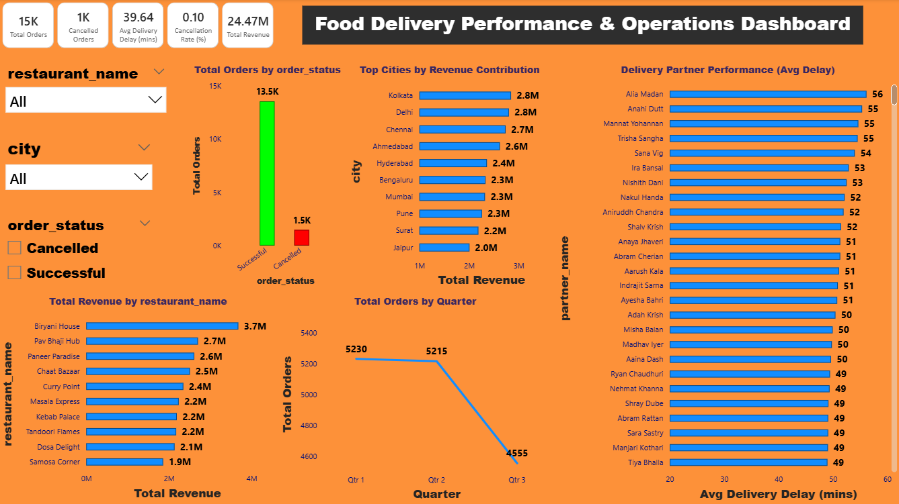

## Business Problem
A food delivery company wants to analyze order performance, delivery efficiency, and customer behavior to improve operational efficiency and customer satisfaction.

## Business Questions
1. What percentage of orders are cancelled?
2. Which restaurants generate the highest revenue?
3. Are higher-rated restaurants delivering faster?
4. How often do deliveries exceed expected delivery time?
5. Which cities face the most delivery delays?
6. Which delivery partners are most efficient?

# 🍽️ Food Delivery Performance & Operations Analytics  
*(Mini Project – Data Analytics Portfolio)*

## 📌 Business Problem
Food delivery platforms operate at scale and must balance **revenue growth**, **order success**, and **delivery efficiency**.  
This project analyzes business and operational performance to identify key drivers of revenue, cancellations, and delivery delays, and to provide actionable recommendations for improvement.

---

## 📂 Dataset Description
The analysis is based on a **Swiggy-like food delivery dataset** stored in a single Excel file with four related sheets:

- **Orders** – Order details, status, pricing, quantity, and delivery timings  
- **Customers** – Customer demographic and location information  
- **Restaurants** – Restaurant details including city, ratings, and reviews  
- **Delivery Partners** – Delivery partner details and assigned cities  

The raw data was cleaned, transformed, and feature-engineered before analysis.

---

## 🛠️ Tools & Technologies Used
- **Python (Pandas)** – Data cleaning, transformation, feature engineering  
- **SQL** – Business queries, joins, aggregations, and window functions  
- **Power BI** – Data modeling, KPIs, and interactive dashboard  
- **Excel** – Data storage and intermediate validation  

---

## 🔎 Analysis Approach

### 1️⃣ Data Preparation (Python)
- Loaded multi-sheet Excel data using Pandas  
- Standardized column names and corrected data types  
- Created derived metrics:
  - `order_value`
  - `delivery_delay_mins`
  - `is_delayed`
- Optimized memory using categorical data types  
- Exported cleaned datasets to a new Excel file for downstream analysis

---

### 2️⃣ SQL Analysis
- Imported cleaned data into a SQL schema  
- Answered key business questions using:
  - Aggregations (COUNT, SUM, AVG)
  - JOINs across orders, customers, restaurants, and delivery partners
  - Window functions to rank delivery partner performance  
- Focused analysis areas:
  - Order cancellations
  - Revenue contribution
  - Delivery efficiency and delays

---

### 3️⃣ Power BI Dashboard
- Built a clean, star-like data model with proper relationships  
- Created key KPIs:
  - Total Orders
  - Total Revenue
  - Cancellation Rate
  - Average Delivery Delay  
- Designed a **single-page interactive dashboard** featuring:
  - Orders by status
  - Revenue by city and restaurant
  - Delivery partner performance
  - Order trends over time  
- Added slicers for city, restaurant, and order status to enable exploration

---

## 📊 Key Insights
- A small percentage of orders are cancelled, but they contribute significantly to operational inefficiency  
- Revenue is concentrated in a few top-performing cities and restaurants  
- Delivery delays vary widely across delivery partners, indicating optimization opportunities  
- Higher restaurant ratings do not always guarantee faster delivery  
- Order volume shows noticeable variation across time periods

---

## 💡 Business Recommendations
- Prioritize operational improvements in cities with consistently higher delivery delays  
- Introduce performance-based incentives for delivery partners  
- Closely monitor high-value orders that experience delivery delays  
- Support mid-performing restaurants in high-revenue cities to improve delivery efficiency  

---

## 📷 Dashboard Preview
A Power BI dashboard was created to present business and operational insights in a clear, executive-friendly format.

---

## ✅ Project Outcome
This mini project demonstrates a complete **end-to-end data analyst workflow**:

- Raw data → cleaned dataset → SQL insights → interactive dashboard  
- Strong focus on business problem-solving and decision-making  
- Portfolio-ready project suitable for entry-level data analyst roles
